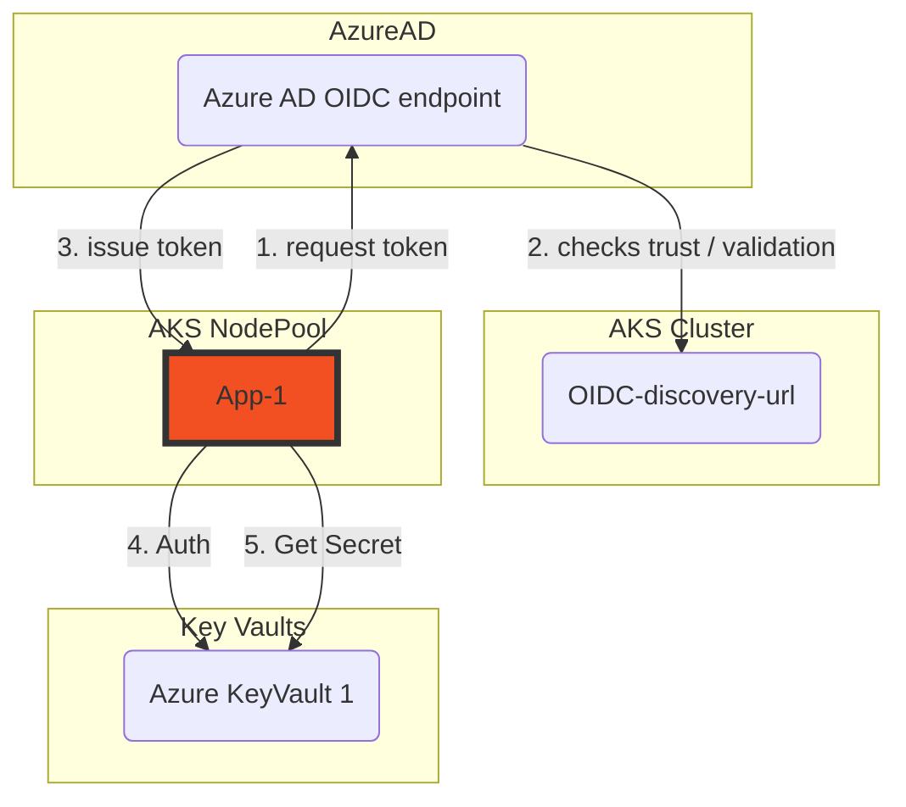
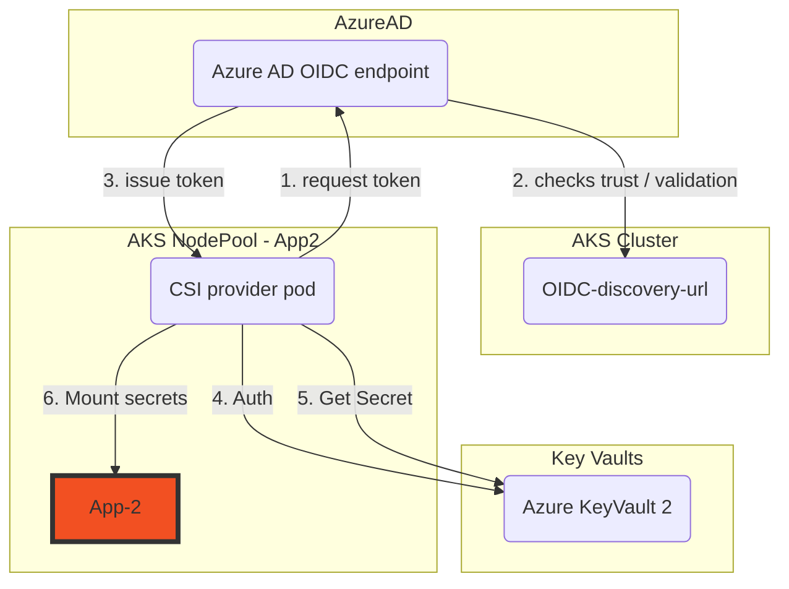
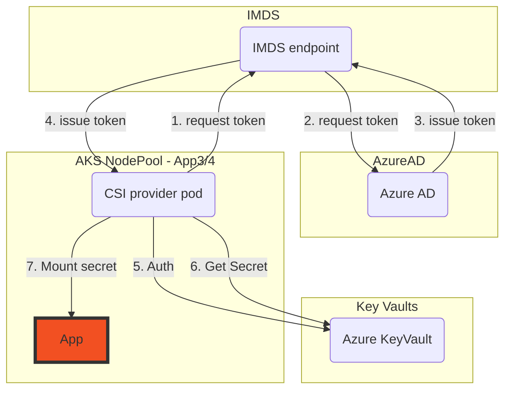
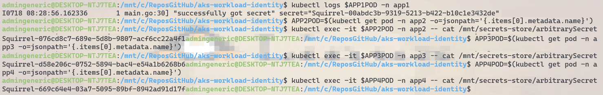

# AKS Workload Identity - Sample

This sample creates an AKS Cluster, and deploys 5 applications which use different Azure Active Directory identities to gain secured access to secrets in different Azure Key Vaults. Each application uses a slightly different authentication method, and with different scopes of access.

This repo provides Infrastructure code, scripts and application manifests to showcase **complete end to end examples** to help you evaluate which scenario works best for your application.

App # | Key Scenario | Identity | Uses CSI Secrets driver | Scope | Comments
----- | ------------ | -------- | ----------------------- | ----- | --------
1 | Code focussed, few infra dependencies | Workload Identity (Managed Identity) | :x: | Service Account (Pod) | Accesses the KeyVault directly from the code in the container
2 | Infra focussed, provides abstraction | Workload Identity (Service Principal) | :heavy_check_mark: | Service Account (Pod) |
3 | VM Nodepool focussed | User Assigned Managed Identity | :heavy_check_mark: | AKS Node Pool
4 | Simple and fast | Managed Identity | :heavy_check_mark: | All AKS Node Pools | Leverages the AKS managed azureKeyvaultSecretsProvider identity
5 | Infra focussed, provides abstraction and operational simplicity | Workload Identity (Managed Id) | :heavy_check_mark: | Service Account (Pod) | A ManagedId implementation of App #2

The purpose of this sample is to demonstrate the different methods for accessing Key Vaults and the *multi-tenancy* implications of accessing application credential stores in AKS.

## Features

This project framework provides the following features:

* AKS Cluster, configured as an OIDC issuer for Workload Identity with the CSI Secrets driver installed
* Azure Key Vault, for application secret storage
* Azure Workload Identity, for application access to the Key Vaults

### CSI Secrets driver

The [Azure CSI Secrets driver](https://docs.microsoft.com/azure/aks/csi-secrets-store-driver) brings simplicity to the application developers by abstracting the Key Vault and mounting the secrets to the pod. It does however create more configuration in the Kubernetes manifests for the applications.

### Azure Workload Identity

Enabling workload identity on an AKS cluster creates an [OIDC issuer](https://learn.microsoft.com/azure/aks/cluster-configuration#oidc-issuer) that can then be used to authenticate a workload running to an OIDC provider (Azure Active Directory in this example).

[Workload Identities](https://github.com/Azure/azure-workload-identity) facilitate a narrow scope of use of a service account for exclusive use by an application instead of an identity that is leveraged at the VM level that could be used by multiple applications. 

### Auth Diagrams

#### App1 (workload identity)



#### App 2 & 5 (workload identity + csi)



#### Apps 3 & 4 (managed identity + csi)


## Getting Started

### Prerequisites

Interaction with Azure is done using the [Azure CLI](https://docs.microsoft.com/cli/azure/), [Helm](https://helm.sh/docs/intro/install/) and [Kubectl](https://kubernetes.io/docs/tasks/tools/#kubectl) are required for accessing Kubernetes packages and installing them to the cluster.

[JQ](https://stedolan.github.io/jq/download/) is used for transforming json objects in the script samples. It's a commonly used binary available in the Azure CLI, on GitHub runners etc.

OIDC Issuer is an AKS Feature, and is required for Workload Identity to function.

### Installation

#### AKS

Using [AKS Construction](https://github.com/Azure/Aks-Construction), we can quickly set up an AKS cluster to the correct configuration. It has been referenced as a git submodule, and therefore easily consumed in [this projects bicep infrastructure file](main.bicep).

The main.bicep deployment creates
- 1 AKS Cluster, with CSI Secrets Managed Identity
- 5 Azure Key Vaults
- 3 User Assigned Managed Identities
- The Azure Workload Identity Mutating Admission Webhook on the AKS cluster

### Guide

#### 1. clone the repo

```
git clone https://github.com/Azure-Samples/aks-workload-identity.git
cd aks-workload-identity
```

#### 2. Deploy the infrastructure to your azure subscription

```bash
RGNAME=akswi
az group create -n $RGNAME -l EastUs
DEP=$(az deployment group create -g $RGNAME -f main.bicep -o json)
OIDCISSUERURL=$(echo $DEP | jq -r '.properties.outputs.aksOidcIssuerUrl.value')
AKSCLUSTER=$(echo $DEP | jq -r '.properties.outputs.aksClusterName.value')
APP1KVNAME=$(echo $DEP | jq -r '.properties.outputs.kvApp1Name.value')
APP2KVNAME=$(echo $DEP | jq -r '.properties.outputs.kvApp2Name.value')
APP3KVNAME=$(echo $DEP | jq -r '.properties.outputs.kvApp3Name.value')
APP4KVNAME=$(echo $DEP | jq -r '.properties.outputs.kvApp4Name.value')
APP5KVNAME=$(echo $DEP | jq -r '.properties.outputs.kvApp5Name.value')
APP1=$(echo $DEP | jq -r '.properties.outputs.idApp1ClientId.value')
APP3=$(echo $DEP | jq -r '.properties.outputs.idApp3ClientId.value')
APP5=$(echo $DEP | jq -r '.properties.outputs.idApp5ClientId.value')

az aks get-credentials -n $AKSCLUSTER -g $RGNAME --overwrite-existing
```

#### 3. Create AAD Service Principals (and applications) for app2

```bash
APP2=$(az ad sp create-for-rbac --name "AksWiApp2" --query "appId" -o tsv)
```

#### 4. AAD application permissions on KeyVault

We need to explicitly allow Service Principals access to secrets in the respective KeyVault. Apps using Managed Identities were already granted RBAC during the bicep infrastructure creation.

```bash
APP2SPID="$(az ad sp show --id $APP2 --query id -o tsv)"
az deployment group create -g $RGNAME -f kvRbac.bicep -p kvName=$APP2KVNAME appclientId=$APP2SPID

#App4
CSICLIENTID=$(az aks show -g $RGNAME --name $AKSCLUSTER --query addonProfiles.azureKeyvaultSecretsProvider.identity.clientId -o tsv)
CSIOBJECTID=$(az aks show -g $RGNAME --name $AKSCLUSTER --query addonProfiles.azureKeyvaultSecretsProvider.identity.objectId -o tsv)
az deployment group create -g $RGNAME -f kvRbac.bicep -p kvName=$APP4KVNAME appclientId=$CSIOBJECTID
```

#### 5. Deploy the applications

```bash
TENANTID=$(az account show --query tenantId -o tsv)

helm upgrade --install app1 charts/workloadIdApp1 --set azureWorkloadIdentity.tenantId=$TENANTID,azureWorkloadIdentity.clientId=$APP1,keyvaultName=$APP1KVNAME,secretName=arbitrarySecret -n app1 --create-namespace

helm upgrade --install app2 charts/workloadIdApp2 --set azureWorkloadIdentity.tenantId=$TENANTID,azureWorkloadIdentity.clientId=$APP2,keyvaultName=$APP2KVNAME,secretName=arbitrarySecret -n app2 --create-namespace

helm upgrade --install app3 charts/csiApp --set azureKVIdentity.tenantId=$TENANTID,azureKVIdentity.clientId=$APP3,keyvaultName=$APP3KVNAME,secretName=arbitrarySecret -n app3 --create-namespace

helm upgrade --install app4 charts/csiApp --set azureKVIdentity.tenantId=$TENANTID,azureKVIdentity.clientId=$CSICLIENTID,keyvaultName=$APP4KVNAME,secretName=arbitrarySecret -n app4 --create-namespace

helm upgrade --install app5 charts/workloadIdApp2 --set nameOverride=workloadidapp5,azureWorkloadIdentity.tenantId=$TENANTID,azureWorkloadIdentity.clientId=$APP5,keyvaultName=$APP5KVNAME,secretName=arbitrarySecret -n app5 --create-namespace
```

#### 6. Checking the workloads

At this point 3 out of 5 applications should be working. 

We're expecting that application 2 won't yet be working as it is missing Federated Id configuration to trust the AKS Cluster. The errors from these application logs will however be useful to see what is expected to be provided when we created the Federated Identity.

Application 3 will also require other actions before it'll work, as the VM's used in AKS need to be told about this new identity (step 8).

```bash
APP2POD=$(kubectl get pod -n app2 -o=jsonpath='{.items[0].metadata.name}')
kubectl logs $APP2POD -n app2

#error: AADSTS70021: No matching federated identity record found for presented assertion. Assertion Issuer: 'https://oidc.prod-aks.azure.com/REDACTED/'. Assertion Subject: 'system:serviceaccount:default:app2-workloadidapp'. Assertion Audience: 'api://AzureADTokenExchange'.
```

#### 7. Establish federated identity credentials for the workload identities

App2

```bash 
APP2SVCACCNT="app2-workloadidapp2"
APP2NAMESPACE="app2"
APP2APPOBJECTID="$(az ad app show --id $APP2 --query id -o tsv)"

#Create federated identity credentials for use from an AKS Cluster Service Account
fedReqUrl="https://graph.microsoft.com/beta/applications/$APP2APPOBJECTID/federatedIdentityCredentials"
fedReqBody=$(jq -n --arg n "kubernetes-$AKSCLUSTER-$APP2NAMESPACE-app2" \
                   --arg i $OIDCISSUERURL \
                   --arg s "system:serviceaccount:$APP2NAMESPACE:$APP2SVCACCNT" \
                   --arg d "Kubernetes service account federated credential" \
             '{name:$n,issuer:$i,subject:$s,description:$d,audiences:["api://AzureADTokenExchange"]}')
echo $fedReqBody | jq -r
az rest --method POST --uri $fedReqUrl --body "$fedReqBody"
```

#### 8. Assigning Managed Identity to the VMSS

The last step in getting App3 working is to assign the User Assigned Managed Identity to the Virtual Machine Scaleset used by the AKS User nodepool.

```bash
NODEPOOLNAME=$(echo $DEP | jq -r '.properties.outputs.aksUserNodePoolName.value')
RGNODE=$(echo $DEP | jq -r '.properties.outputs.nodeResourceGroup.value')
APP3RESID=$(echo $DEP | jq -r '.properties.outputs.idApp3Id.value')
VMSSNAME=$(az vmss list -g $RGNODE --query "[?tags.\"aks-managed-poolName\" == '$NODEPOOLNAME'].name" -o tsv)
az vmss identity assign -g $RGNODE -n $VMSSNAME --identities $APP3RESID
```

#### 9. Seeing all the apps working

These scripts show the pod successfully accessing the secret in the respective application Key Vaults.

```bash
APP1POD=$(kubectl get pod -n app1 -o=jsonpath='{.items[0].metadata.name}')
kubectl logs $APP1POD -n app1

APP2POD=$(kubectl get pod -n app2 -o=jsonpath='{.items[0].metadata.name}')
kubectl exec -it $APP2POD -n app2 -- cat /mnt/secrets-store/arbitrarySecret

APP3POD=$(kubectl get pod -n app3 -o=jsonpath='{.items[0].metadata.name}')
kubectl exec -it $APP3POD -n app3 -- cat /mnt/secrets-store/arbitrarySecret

APP4POD=$(kubectl get pod -n app4 -o=jsonpath='{.items[0].metadata.name}')
kubectl exec -it $APP4POD -n app4 -- cat /mnt/secrets-store/arbitrarySecret
```



#### 10. Cleanup

```bash
az group delete -n $RGNAME

#Navigate to the Azure Portal, Azure Active Directory to delete the AksWiApp1 and AksWiApp2 service principals

```

## Resources

- [Azure Workload Identity](https://github.com/Azure/azure-workload-identity)
- [Azure AD workload identity federation with Kubernetes](https://blog.identitydigest.com/azuread-federate-k8s/)
- [Azure Key Vault provider for Secrets Store CSI Driver](https://azure.github.io/secrets-store-csi-driver-provider-azure/docs/getting-started/usage/)
- [Managed Identity FAQ](https://docs.microsoft.com/azure/active-directory/managed-identities-azure-resources/managed-identities-faq)